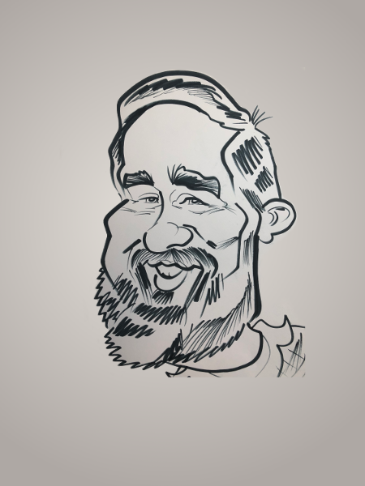

# About Me

    

I've been programming professionally since 1999. Just about all of this
time has been spent developing for the web. In my early days I was 
using Linux/Apache/MySQL/Perl, my version of LAMP 😀. Then it was on to 
SQL Server, C# ASP.Net (WebForms first then MVC later) and currently 
SPA's using various frameworks and a lot of JavaScript/TypeScript. 

In my spare time, I like to dabble with whatever catches my eye. 
Lately I've been spending a lot of time learning about graphql.

* [Links](links.html)
