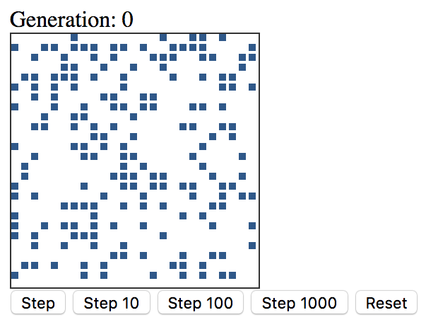

# Projects
* [Voice](https://voice.com){:target="_blank"}
  Current day job involves working all the Voice.com web frontend as well as the api/backend services.

## Samples
* [Conway's Game of Life](https://github.com/zeelux/conways-game-of-life){:target="_blank"}
    An implementation of Conway's Game of Life using an HTML Canvas element to render.
    
* [BlackJack Bot Runner](https://blackjack-rvnug.azurewebsites.net){:target="_blank"}
    Players code a bot using a built-in JavaScript editor to play BlackJack. [Source](https://github.com/RVNUG/blackjack){:target="_blank"}

## Small one-off library functions and utilities
* [JS Sort](https://github.com/zeelux/jssort){:target="_blank"}
    Sort JS arrays of objects by multiple properties on the objects.
* [Knockout Paging Extender](https://github.com/zeelux/koPagingExtender/blob/master/ko.extenders.paging-v0.1.0.js){:target="_blank"}
    Simplifies adding paging support to Knockout Observable Arrays
